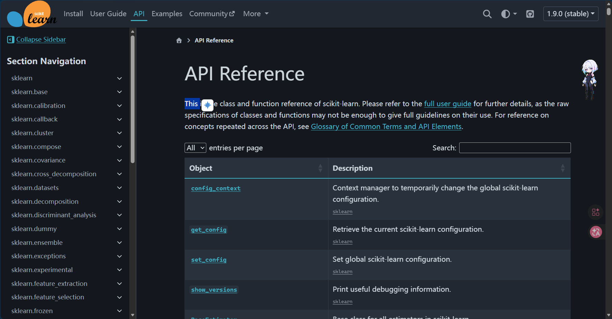
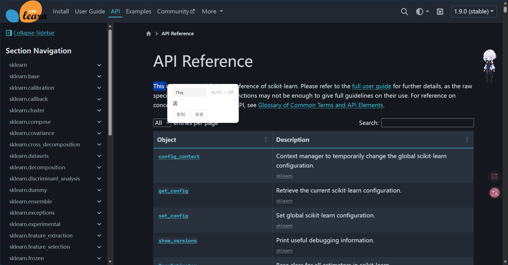
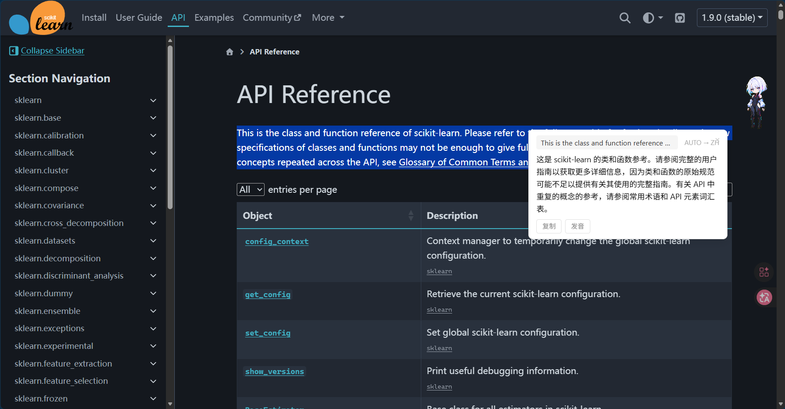

# 自动划词翻译浏览器插件

[中文](README.md) | [English](README.en.md)

这是一个基于 Manifest V3 的浏览器扩展，用来在网页中快速翻译选中的文本。项目不依赖构建工具，保留源码目录后即可在 Chrome、Edge 等 Chromium 浏览器中通过“加载已解压的扩展程序”运行。

## 项目结论

- 插件核心由 `manifest.json`、后台脚本、内容脚本、弹窗页面、设置页面、图标和本地化文件组成。
- 当前版本可以直接加载源码目录运行，不需要安装 `node_modules`。
- `package.json` 只提供压缩打包脚本，不是插件运行必需文件。
- `.superpowers/`、`.worktrees/`、`docs/superpowers/` 属于开发过程资料，不是发布到 GitHub 或安装插件时的必需内容。

## 功能特性

- 网页选中文本后显示“译”触发按钮，点击按钮后展示翻译弹窗。
- 支持右键菜单“翻译选中文本”。
- 支持工具栏弹窗中手动输入文本并翻译。
- 支持源语言自动检测和常见目标语言切换。
- 支持复制翻译结果、浏览器语音朗读、字符统计和语言交换。
- 支持选项页保存 API、语言、缓存、右键菜单、快捷键等配置。
- 支持 `zh_CN` 和 `en` 两套扩展名称与描述。

## 演示截图

### 1. 选中目标后会弹出扩展图标



### 2. 支持单一词语翻译



### 3. 支持整段文字翻译



## 技术栈

- Manifest V3
- WebExtensions / Chrome Extension API
- 原生 JavaScript、HTML、CSS
- `chrome.storage.sync` 保存配置
- `chrome.contextMenus` 提供右键菜单
- `chrome.runtime.sendMessage` 连接内容脚本、弹窗和后台脚本

## 运行机制

1. `content_scripts/content.js` 注入网页，监听鼠标选择文本。
2. 用户选中文本后，页面旁边出现“译”按钮。
3. 点击按钮或使用右键菜单后，内容脚本向 `background/background.js` 发送翻译请求。
4. 后台脚本优先请求 Google Translate 的公开接口，失败后回退到 MyMemory API。
5. 翻译结果返回内容脚本，并显示在网页浮层中。
6. `popup/` 提供工具栏弹窗翻译；`options/` 提供配置页面。

> 注意：选项页里保留了 LibreTranslate、Google、DeepL 等配置字段，但当前后台翻译逻辑没有按 `apiService` 动态切换服务；实际运行时以 Google Translate 公开接口优先，MyMemory 作为回退。

## 目录结构

```text
自动翻译插件/
├── manifest.json              # 浏览器扩展清单，插件入口
├── background/
│   └── background.js          # 后台服务工作线程：翻译、缓存、配置、右键菜单
├── content_scripts/
│   ├── content.js             # 网页内容脚本：划词触发按钮、翻译弹窗
│   └── content.css            # 划词按钮和翻译弹窗样式
├── popup/
│   ├── popup.html             # 工具栏弹窗页面
│   ├── popup.css              # 弹窗样式
│   └── popup.js               # 弹窗翻译、复制、发音、语言切换逻辑
├── options/
│   ├── options.html           # 设置页面
│   └── options.js             # 设置读取、保存、重置、API 测试逻辑
├── icons/
│   ├── icon16.png             # 16 像素扩展图标
│   ├── icon48.png             # 48 像素扩展图标
│   └── icon128.png            # 128 像素扩展图标
├── _locales/
│   ├── zh_CN/messages.json    # 中文扩展名称和描述
│   └── en/messages.json       # 英文扩展名称和描述
├── assets/
│   └── demo/                   # README 演示截图
├── README.md                  # 项目说明
├── README.en.md               # 英文项目说明
├── TESTING.md                 # 手动测试清单
├── 使用教程.md                # 用户使用教程
├── LICENSE                    # MIT 开源许可证
├── package.json               # 可选：压缩打包脚本
└── .gitignore                 # Git 忽略规则
```

## 安装方法

### Chrome / Edge

1. 打开扩展管理页面：
   - Chrome：`chrome://extensions/`
   - Edge：`edge://extensions/`
2. 开启“开发者模式”。
3. 点击“加载已解压的扩展程序”。
4. 选择包含 `manifest.json` 的项目目录。

### Firefox

当前项目使用 Manifest V3 和 `chrome.*` API，主要面向 Chrome / Edge。Firefox 支持情况需要结合目标版本测试确认。

## 使用方法

### 网页划词翻译

1. 在网页中选中一段文本。
2. 选区旁边会出现“译”按钮。
3. 点击“译”按钮。
4. 查看翻译弹窗，可复制或朗读翻译结果。

### 右键菜单翻译

1. 在网页中选中文本。
2. 右键点击选区。
3. 选择“翻译选中文本”。

### 工具栏弹窗翻译

1. 点击浏览器工具栏中的扩展图标。
2. 输入或粘贴要翻译的文本。
3. 选择源语言和目标语言。
4. 点击“翻译”。

### 设置页面

在弹窗中点击设置按钮，或在浏览器扩展管理页面打开扩展选项，可配置：

- 翻译服务字段
- API 地址和密钥字段
- 目标语言
- 自动划词翻译开关
- 翻译弹窗开关
- 缓存开关
- 右键菜单开关
- 快捷键开关
- 防抖延迟和缓存大小

## 开发说明

本项目没有安装依赖步骤。修改源码后，在浏览器扩展管理页面点击“重新加载”即可查看效果。

如需压缩打包，可在支持 `zip` 命令的终端中运行：

```bash
npm run build:chrome
```

或：

```bash
npm run build:firefox
```

## 测试建议

可以参考 `TESTING.md` 做手动测试，重点检查：

- 扩展能否正常加载。
- 网页选中文本后是否出现“译”按钮。
- 点击“译”按钮后是否能显示翻译弹窗。
- 右键菜单是否能触发翻译。
- 工具栏弹窗是否能手动翻译。
- 设置页面是否能保存和恢复配置。
- 网络失败时是否能显示错误信息。

## GitHub 发布整理

本项目已整理出 `github/` 目录，里面只放入适合发布到 GitHub 的源码和说明文件。可以先进入该目录检查内容，确认无误后再单独初始化或推送到远程仓库。

## 许可证

本项目使用 MIT License，详见 `LICENSE` 文件。
